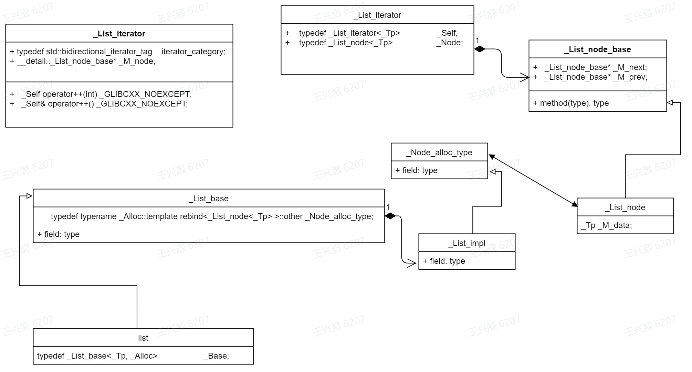
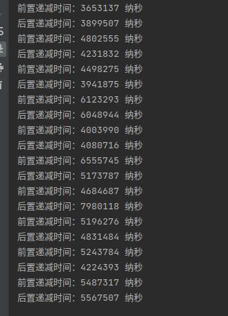

# stl list

## 关系图




## 宏学习

### _GLIBCXX_USE_NOEXCEPT

用于指示在编译C++代码时是否启用noexcept异常规范。noexcept是C++11引入的异常规范关键字，用于指示函数不会抛出任何异常。_GLIBCXX_USE_NOEXCEPT宏定义的存在可以用于控制在标准库实现中是否启用了noexcept异常规范。


## 类和结构体

> _List_iterator，所有函数都是对操作符进行重载

```C++
  /// Bidirectional iterators support a superset of forward iterator operations.
  struct bidirectional_iterator_tag : public forward_iterator_tag { };

  /**
   *  @brief A list::iterator.
   *
   *  All the functions are op overloads.
  */
  template<typename _Tp>
    struct _List_iterator
    {
      typedef _List_iterator<_Tp>                _Self;
      typedef _List_node<_Tp>                    _Node;

      typedef ptrdiff_t                          difference_type;
      typedef std::bidirectional_iterator_tag    iterator_category;
      typedef _Tp                                value_type;
      typedef _Tp*                               pointer;
      typedef _Tp&                               reference;
      
      // The only member points to the %list element.
      __detail::_List_node_base* _M_node;
    }
```

> ptrdiff_t

```C++
#define __PTRDIFF_TYPE__ long int
typedef __PTRDIFF_TYPE__ ptrdiff_t;
```

> 操作符前--和后--

```C++
//operator--() 是前置递减运算符，它在迭代器上进行递减操作并返回递减后的迭代器。
//它没有任何参数，并且在修改迭代器之后立即返回修改后的值。
_Self& operator++() _GLIBCXX_NOEXCEPT;

//operator--(int) 是后置递减运算符，它在迭代器上进行递减操作，但返回的是递减前的迭代器的副本。
//它有一个额外的 int 参数（这个参数没有实际意义），用于区分前置递减运算符。
_Self operator++(int) _GLIBCXX_NOEXCEPT;
```

> 没看懂的地方：(不清楚构造是怎样进行的)

```C++
  template<typename _Tp>
    struct _List_node : public __detail::_List_node_base
    {
      ///< User's data.
      _Tp _M_data;

#if __cplusplus >= 201103L
      template<typename... _Args>
        _List_node(_Args&&... __args)
	: __detail::_List_node_base(), _M_data(std::forward<_Args>(__args)...) 
        { }
#endif
    };
```

> std::forward

```C++
#include <iostream>
#include <utility>

struct A {
    A() { std::cout << "default constructor\n"; }
    A(const A&) { std::cout << "copy constructor\n"; }
    A(A&&) { std::cout << "move constructor\n"; }
};

void bar(const A& a) { std::cout << "bar(const A&)\n"; }
void bar(A&& a) { std::cout << "bar(A&&)\n"; }

template<typename T>
void foo(T&& t) {
    bar(t); // without perfect forwarding, always call bar(const A&)
    bar(std::forward<T>(t)); // with perfect forwarding, call bar(A&) or bar(A&&) depending on T
}

int main() {
    A a;
    foo(a); // T is deduced as A&, t is an lvalue reference
    foo(A()); // T is deduced as A, t is an rvalue reference
}

// output
// 使用std::forward时，可以根据参数是左值还是右值来调用不同的bar重载函数
default constructor
bar(const A&)
bar(const A&)
copy constructor
bar(const A&)
bar(A&&)
move constructor
bar(const A&)
bar(A&&)
```

> c++11 增加的改变

```C++
#if __cplusplus >= 201103L
      void
      merge(list&& __x);

      void
      merge(list& __x)
      { merge(std::move(__x)); }
#else
      void
      merge(list& __x);
#endif

#if __cplusplus >= 201103L
      erase(const_iterator __first, const_iterator __last) noexcept
#else
      erase(iterator __first, iterator __last)
#endif
      {
	while (__first != __last)
	  __first = erase(__first);
	return __last._M_const_cast();
      }
```

> erase函数 : 仅删除元素本身，如果元素是一个指针，那么指针指向的数据不受影响。没有清理的数据可能会造成之后的脏读。

```C++
// This function will erase the element at the given position and thus
// shorten the %list by one.
```


## 测试

观察到，前++和后++在源代码上有不同次数的拷贝构造，在各大网站上也对两种调用有多次提及，都说前++的性能更好。在本次学习中用list对前++和后++进行了性能测试。

测试结果如下：




结论：因为编译器的优化，前++和后++在实际编码中并没有多大区别。

参考：
尚未验证的信息，仅供参考。
```C++
Run on (4 X 2400 MHz CPU s)
CPU Caches:
  L1 Data 32 KiB (x2)
  L1 Instruction 32 KiB (x2)
  L2 Unified 256 KiB (x2)
  L3 Unified 3072 KiB (x1)
Load Average: 0.25, 0.18, 0.12
------------------------------------------------------------
Benchmark                  Time             CPU   Iterations
------------------------------------------------------------
BM_PrefixDecrement/8     118 ns          118 ns      5933333
BM_PrefixDecrement/64    948 ns          948 ns       738462
BM_PrefixDecrement/512  7.59 us         7.59 us        92160
BM_PrefixDecrement/4k   60.6 us         60.6 us        11538
BM_PrefixDecrement/8k    121 us          121 us         5769
BM_PostfixDecrement/8    118 ns          118 ns      5933333
BM_PostfixDecrement/64   949 ns          949 ns       738462
BM_PostfixDecrement/512 7.60 us         7.60 us        92160
BM_PostfixDecrement/4k   61.0 us         61.0 us       11538
BM_PostfixDecrement/8k    122 us          122 us        5769
```

